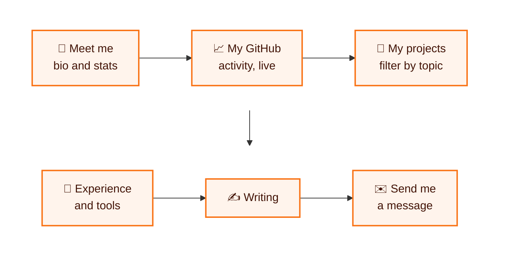
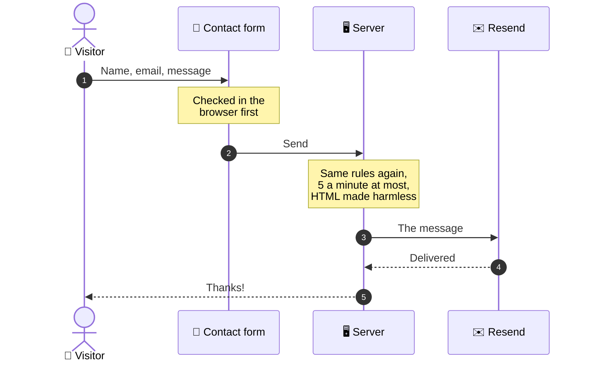
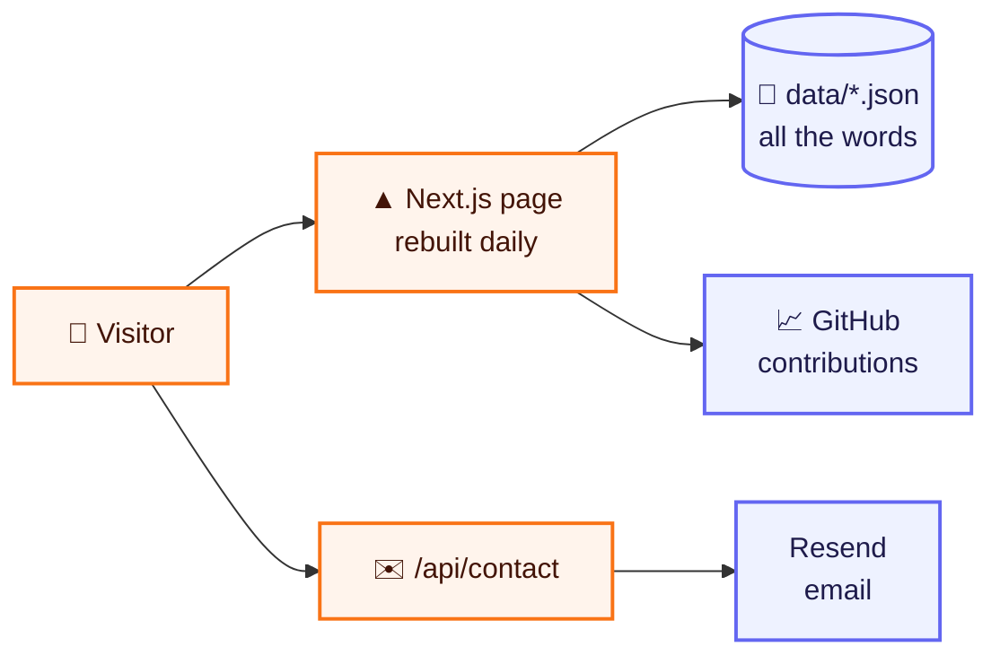

<div align="center">

# ✨ Portfolio — Aryan Deshmukh

### Who I am, what I've built, and how to reach me — on one page

**A personal portfolio with a fixed profile card, a live view of my GitHub activity,<br/>my projects, and a contact form that lands straight in my inbox.**

<br/>

   
<br/>
  

</div>

---

## 👋 In 30 seconds

<table>
<tr>
<td width="22%">

😟 **The problem**

</td>
<td>

A GitHub profile shows code, but not the person behind it: what they care about, what they've shipped, and how to get in touch.

</td>
</tr>
<tr>
<td width="22%">

💡 **The idea**

</td>
<td>

One fast page that tells the whole story in order — who I am, my live GitHub activity, my projects, experience and tools — with a contact form at the end.

</td>
</tr>
<tr>
<td width="22%">

🎯 **Who it's for**

</td>
<td>

Recruiters, collaborators and anyone curious about my work.

</td>
</tr>
<tr>
<td width="22%">

🚦 **Where it is**

</td>
<td>

Designed and built, and ready to deploy. The final content — résumé, experience and writing — is being filled in. See the [roadmap](#roadmap).

</td>
</tr>
</table>

---

## 🧭 How a visit goes



On a desktop, the profile card stays fixed on the left while only the content column scrolls.

---

## ✨ What's on the page

<table>
<tr>
<td width="50%" valign="top">

### 👋 A profile that stays put
Photo, name, role and social links in a card that never scrolls away, next to a short bio and a few headline numbers.

</td>
<td width="50%" valign="top">

### 📈 Live GitHub activity
The last twelve months of contributions, refreshed from GitHub each day — no access token to set up, and a plain link to GitHub if that service is ever down.

</td>
</tr>
<tr>
<td valign="top">

### 🚀 Projects, filterable
Each project with its stack, a link to the code and a live demo where there is one. Filter chips, built from each project's tags, reorder the list with animation.

</td>
<td valign="top">

### ✉️ A contact form that works
Checked in the browser and again on the server with the same rules, rate-limited against spam, and delivered to my inbox by email.

</td>
</tr>
<tr>
<td colspan="2" valign="top">

### 🎨 A distinct look
Near-black surfaces, a vivid orange accent, oversized two-tone headings and a glass-effect dock for navigation — built to a written design brief.

</td>
</tr>
</table>

---

## 📮 What happens when someone sends a message



---

## 🏗️ How it's built



| Layer | Tool | Why this one |
|---|---|---|
| 🖥️ Website | **Next.js 16 + React 19 + TypeScript** | A fast static page, plus one server route for the form |
| 🎨 Look and feel | **Tailwind CSS 4 + Motion** | The design brief's look, with smooth entrances and reordering |
| ✉️ Email | **Resend** | Delivers contact messages; works in local development without a key |
| 📄 Content | **Plain JSON files** | Every word on the site can change without touching code |

---

## 🛡️ Built with care

| | What it means | How it's done |
|---|---|---|
| ✅ | **One set of rules for the form** | The browser and the server validate with the same shared schema, so they can't disagree. |
| 🚦 | **Spam-resistant** | The contact route allows five messages a minute from any one address. |
| 🧼 | **Safe emails** | Everything a visitor types is escaped before it goes into the email. |
| 🌧️ | **Never breaks on someone else's outage** | If the GitHub activity service is down, that section offers a link to GitHub instead, and the rest of the page loads as normal. |
| 🔌 | **Ready for a CMS** | Only one file reads the content, so swapping JSON for a CMS touches nothing that draws the page. |

---

<a name="roadmap"></a>

## 🗺️ Roadmap

| Status | Milestone |
|:---:|---|
| ✅ | The full design: fixed profile card, glass dock, two-tone headings |
| ✅ | All seven sections on one page, with a live GitHub activity graph |
| ✅ | A working contact form, delivered by email |
| 🔜 | Final content: my real résumé, experience and writing, replacing the placeholders |
| 🔜 | Deploy it on Vercel, with its own address |

---

## 📁 What's in this repository

```
📦 portfolio
├── 📂 app/          the page, the 404 page and the contact API
├── 📂 components/   the profile card, dock, sections and animations
├── 📂 data/         all the words: profile, projects, experience, tools, posts
├── 📂 lib/          content loading, GitHub activity, form rules
├── 📂 public/       photo and résumé
└── 📂 docs/         the developer guide
```

---

## 👩‍💻 For developers

You need **Node.js** (current LTS).

```bash
npm install
```

```bash
npm run dev
```

Then open <http://localhost:3000>. The contact form works without an email key — messages are printed to the console instead.

**The full developer guide is in [`docs/DEVELOPER-GUIDE.md`](docs/DEVELOPER-GUIDE.md):**

| Topic | Jump to |
|---|---|
| ✏️ Changing the words on the site | [Editing content](docs/DEVELOPER-GUIDE.md#editing-content) |
| ✉️ Setting up email | [Contact form](docs/DEVELOPER-GUIDE.md#contact-form) |
| ☁️ Putting it online | [Deploying](docs/DEVELOPER-GUIDE.md#deploying) |

---

<div align="center">

**Built by [Aryan Deshmukh](https://github.com/AryanDeshmukh-2711)**

</div>
